# Egli2.0 — Architecture & Data Flow

```mermaid
%%{init: {'theme': 'dark', 'themeVariables': { 'fontSize': '13px', 'primaryColor': '#6366f1', 'primaryTextColor': '#e2e8f0', 'lineColor': '#4b5563', 'secondaryColor': '#1e293b', 'tertiaryColor': '#0f172a'}}}%%

graph TB
    subgraph Users["👤 User Interaction"]
        Browser["🌐 Browser / Dashboard"]
        CLI["💻 CLI / curl / API Clients"]
    end

    subgraph Docker["🐳 Docker Compose Stack"]
        direction LR
        
        subgraph Frontend["Frontend (Nginx + React)"]
            Nginx["Nginx Reverse Proxy\nPort 80/443"]
            ReactApp["React 18 + Vite\nTailwindCSS + Recharts"]
            
            subgraph ReactComponents["React Components"]
                Layout["Layout\nSidebar + Header"]
                SysOverview["SystemOverview\nStats + Gauges"]
                ServerCard["ServerCard\nPer-server Gauges"]
                MetricChart["MetricChart\nRecharts Sparklines"]
                AlertPanel["AlertPanel\nFilter + Manage"]
                AIChat["AIChat\nChat Interface"]
                NetworkTop["NetworkTopology\nVisual Map"]
                AnomalyDet["AnomalyDetection\nAnomaly Explorer"]
                SelfHeal["SelfHealingPanel\nAuto-Fix Controls"]
                ForecastView["ForecastCard\nPredictive Charts"]
                Toast["Toast\nNotifications"]
            end
        end

        subgraph Backend["Backend (FastAPI Python)"]
            FastAPI["FastAPI Server\nPort 8000"]
            
            subgraph APIRoutes["API Routes"]
                ServersAPI["/api/servers\nCRUD + Bulk Import/Export"]
                MetricsAPI["/api/metrics\nCurrent + History"]
                AlertsAPI["/api/alerts\nList + Ack + Resolve"]
                AIAPI["/api/ai\nChat + Analyze + Stream"]
                WSAPI["/ws/metrics\nWebSocket Real-time"]
                RemediationAPI["/api/alerts/*/remediate\nActions + AI"]
                CustomChecksAPI["/api/checks\nCustom Service Checks"]
                VectorAPI["/api/vectors\nCache Stats"]
            end

            subgraph Services["Backend Services (Singletons)"]
                SNMPPoller["SNMP Poller\nSNMP v2c/v3 + Mock Fallback"]
                AlertEngine["Alert Engine\nThreshold Evaluation + Lifecycle"]
                AIService["AI Service\nOllama Client + Cache Tracking"]
                Forecaster["Forecaster\nLinear Regression + Predictions"]
                AnomalyDetector["Anomaly Detector\nZ-score Baselines + Time-of-day"]
                RemediationEngine["Remediation Engine\nPredefined Recipes + Cooldowns"]
                CustomCheckRunner["Custom Check Runner\nTCP/HTTP + Concurrency"]
                VectorStore["Vector Store\nQdrant Client + Embeddings"]
            end

            subgraph Models["Pydantic Models (schemas.py)"]
                ServerModels["Server / Metric / Alert\nRequest/Response Models"]
            end

            Config["config.py\nEnvironment Settings"]
            Database["database.py\nInfluxDB Connection Manager"]
        end

        subgraph Infrastructure["Infrastructure Dependencies"]
            InfluxDB["InfluxDB 2.7\nTime-Series Database\nPort 8086"]
            Ollama["Ollama\nLocal LLM Inference\nPort 11434\n(llama3.2 / mistral)"]
            Qdrant["Qdrant\nVector Database\nPort 6333\n(Alert Embeddings)"]
        end
    end

    subgraph Monitoring["📡 Monitoring Services"]
        PollerService["SNMP Poller\nStandalone Microservice\n(monitoring/poller.py)"]
        MockData["Mock Data Generator\n(mock_data/seed.py)"]
        ManagedServers["🖥️ Managed Servers\nSNMP-enabled Targets"]
    end

    subgraph RCA["🔍 Root Cause Analysis (rca/ module)"]
        DepGraph["Dependency Graph\nComponent Relationships"]
        EventStore["Event Store\nTime + Component Indexed"]
        OllamaClient["Ollama Client\nHypothesis Generation"]
        RCAnalysis["RCA Engine\nCorrelation + Investigation"]
    end

    subgraph SelfHealing["⚡ Self-Healing & Automation"]
        Systemd["systemd Services\nHealth Checks + Timers"]
        Notify["Notification Scripts\nAlert + Health Notifications"]
    end

    %% ── Data Flow Connections ──

    %% User → Frontend
    Browser --> Nginx
    CLI --> FastAPI

    %% Frontend Internal
    Nginx --> ReactApp
    ReactApp --> Layout
    Layout --> SysOverview & ServerCard & AlertPanel & AIChat & NetworkTop & AnomalyDet & SelfHeal & ForecastView
    AlertPanel --> Toast
    SysOverview --> MetricChart
    ServerCard --> MetricChart

    %% Frontend → Backend (HTTP)
    ReactApp -.->|"HTTP /api/*"| FastAPI
    ReactApp -.->|"WebSocket /ws/metrics"| WSAPI

    %% Backend Internal
    FastAPI --> APIRoutes
    ServersAPI --> ServersAPI
    MetricsAPI --> MetricsAPI
    AlertsAPI --> AlertsAPI
    AIAPI --> AIAPI
    
    %% API → Services wiring
    ServersAPI --> SNMPPoller
    ServersAPI --> WSAPI

    MetricsAPI --> SNMPPoller
    MetricsAPI --> Database

    AlertsAPI --> AlertEngine
    AlertsAPI --> AIService
    AlertsAPI --> RemediationEngine

    AIAPI --> AIService
    AIAPI --> SNMPPoller
    AIAPI --> AlertEngine
    AIAPI --> Database

    WSAPI --> SNMPPoller
    WSAPI --> AlertEngine
    WSAPI --> CustomCheckRunner
    WSAPI --> VectorStore

    %% Poller Data Flow
    SNMPPoller -->|"Write Metrics"| InfluxDB
    SNMPPoller -->|"Feed Data"| Forecaster
    SNMPPoller -->|"Feed Data"| AnomalyDetector

    AlertEngine -->|"Embed Alerts"| VectorStore
    AIService -->|"Cache Lookup"| VectorStore

    %% Infrastructure Connections
    Database -->|"Flux Queries"| InfluxDB
    AIService -->|"HTTP /api/chat + /api/generate"| Ollama
    VectorStore -->|"HTTP /collections/*"| Qdrant

    %% External Monitoring
    PollerService -->|"SNMP v2c/v3"| ManagedServers
    MockData -->|"Seed Historical Data"| InfluxDB
    SNMPPoller -.->|"Mock Fallback"| ManagedServers

    %% RCA Module
    RCAnalysis --> DepGraph
    RCAnalysis --> EventStore
    RCAnalysis --> OllamaClient
    RCAnalysis -.->|"Reads Alerts"| AlertEngine

    %% Self-Healing
    Systemd -->|"Systemd Timers"| Notify
    RemediationEngine -.->|"SSH Actions"| ManagedServers

    %% ── Styling ──
    classDef frontend fill:#312e81,stroke:#6366f1,color:#e0e7ff
    classDef backend fill:#1e3a5f,stroke:#3b82f6,color:#dbeafe
    classDef infra fill:#1a2e1a,stroke:#22c55e,color:#dcfce7
    classDef monitoring fill:#3b1f1f,stroke:#ef4444,color:#fee2e2
    classDef rca fill:#3b1f3b,stroke:#a855f7,color:#f3e8ff
    classDef healing fill:#3b2e1f,stroke:#f59e0b,color:#fef3c7

    class ReactApp,Layout,SysOverview,ServerCard,MetricChart,AlertPanel,AIChat,NetworkTop,AnomalyDet,SelfHeal,ForecastView,Toast frontend
    class FastAPI,ServersAPI,MetricsAPI,AlertsAPI,AIAPI,WSAPI,RemediationAPI,CustomChecksAPI,VectorAPI,SNMPPoller,AlertEngine,AIService,Forecaster,AnomalyDetector,RemediationEngine,CustomCheckRunner,VectorStore,ServerModels,Config,Database backend
    class InfluxDB,Ollama,Qdrant infra
    class PollerService,MockData,ManagedServers monitoring
    class DepGraph,EventStore,OllamaClient,RCAnalysis rca
    class Systemd,Notify healing
```



---

## 🔄 End-to-End Data Flow

```
SNMP Targets ──► SNMP Poller ──► InfluxDB (Write)
                                      │
    WebSocket ──► WS Manager ──► Alert Engine ──► Frontend Dashboard
       ▲              │                 │
       │              │                 ▼
       │              │          Vector Store (Qdrant)
       │              │                 │
       │              │                 ▼
       │              └──► AI Service (Ollama)
       │                             │
       └───── Streaming SSE ─────────┘

    Frontend ──► REST API ──► Services ──► InfluxDB (Read)
```

## 🏗️ Service Architecture

| Service | Technology | Purpose |
|---------|-----------|---------|
| **Frontend** | React 18 + TailwindCSS + Recharts | NOC-style dark dashboard with live WebSocket updates |
| **Backend** | Python FastAPI + WebSockets | REST API, real-time data streaming, alert evaluation |
| **InfluxDB** | InfluxDB 2.7 | Time-series metric storage with Flux queries |
| **Ollama** | Ollama (llama3.2/mistral) | Local LLM inference — no external API calls |
| **Qdrant** | Qdrant Vector DB | Semantic search for alert pattern cache |
| **SNMP Poller** | Python (easysnmp) | Background metric collection via SNMP v2c/v3 |

## 🔗 API Endpoints Summary

| Method | Endpoint | Description |
|--------|----------|-------------|
| `GET` | `/api/servers` | List all monitored servers |
| `POST` | `/api/servers` | Register a new server |
| `POST` | `/api/servers/bulk-import` | Batch import servers |
| `GET` | `/api/servers/export` | Export all servers as JSON |
| `PUT` | `/api/servers/{id}` | Update server details |
| `DELETE` | `/api/servers/{id}` | Remove a server |
| `POST` | `/api/servers/{id}/test-connection` | Test SNMP connectivity |
| `GET` | `/api/metrics` | Get current metrics for all servers |
| `GET` | `/api/metrics/{server}` | Get metrics for a specific server |
| `GET` | `/api/metrics/history/{server}/{measurement}` | Historical metric data |
| `GET` | `/api/alerts` | List all alerts (filterable) |
| `GET` | `/api/alerts/active` | Get active alerts only |
| `POST` | `/api/alerts/{id}/acknowledge` | Acknowledge an alert |
| `POST` | `/api/alerts/{id}/resolve` | Resolve an alert |
| `GET` | `/api/alerts/{id}/remediation-actions` | Get predefined remediation actions |
| `POST` | `/api/alerts/{id}/execute-action` | Execute a remediation action |
| `POST` | `/api/alerts/{id}/remediate` | Get AI-powered remediation |
| `POST` | `/api/ai/analyze` | Send data for AI analysis |
| `POST` | `/api/ai/chat` | Natural language query |
| `POST` | `/api/ai/chat/stream` | Streaming chat (SSE) |
| `GET` | `/api/ai/health` | AI-generated health report |
| `GET` | `/api/ai/models` | List available Ollama models |
| `GET` | `/api/overview` | Dashboard overview stats |
| `GET` | `/api/health` | Health check |
| `WS` | `/ws/metrics` | Live metric streaming (WebSocket) |
| `GET` | `/api/vectors/cache-stats` | Vector cache performance stats |

## 🧠 AI Cache Pipeline (Three-Tier Optimization)

```
Alert Triggered
       │
       ▼
┌────────────────────────────────────────────┐
│  1️⃣ Semantic Cache (Qdrant)              │
│  ┌─────────────────────────────────────┐   │
│  │ Score ≥ 0.85  → Return cached       │   │
│  │                remediation directly  │   │
│  │                (~50ms)               │   │
│  ├─────────────────────────────────────┤   │
│  │ Score ≥ 0.55  → Use as RAG context  │   │
│  │                + Ollama (~40% tokens)│   │
│  ├─────────────────────────────────────┤   │
│  │ Score < 0.55  → Full Ollama analysis│   │
│  └─────────────────────────────────────┘   │
└────────────────────────────────────────────┘
```

## 📦 Project Structure

```
Egli2.0/
├── backend/app/           # Python FastAPI backend
│   ├── main.py            # App entry point, lifecycle, middleware
│   ├── config.py          # Pydantic settings (env-based)
│   ├── database.py        # InfluxDB connection manager
│   ├── models/schemas.py  # All Pydantic models
│   ├── api/               # REST + WebSocket endpoints
│   │   ├── servers.py     # Server CRUD
│   │   ├── metrics.py     # Metrics retrieval
│   │   ├── alerts.py      # Alert management
│   │   ├── ai.py          # AI chat + analysis
│   │   ├── ws.py          # WebSocket broadcast
│   │   ├── remediation.py # Self-healing actions
│   │   ├── custom_checks.py # Service checks
│   │   └── vector_search.py # Qdrant queries
│   └── services/          # Business logic
│       ├── snmp_poller.py # SNMP polling + mock
│       ├── alert_engine.py# Threshold evaluation
│       ├── ai_service.py  # Ollama integration
│       ├── forecaster.py  # Linear regression forecasts
│       ├── anomaly_detector.py # Z-score detection
│       ├── remediation_engine.py # Action execution
│       ├── custom_checks.py # TCP/HTTP checks
│       └── vector_store.py # Qdrant client
├── frontend/src/          # React + Vite + Tailwind
│   ├── App.jsx            # Root + WebSocket + state
│   ├── components/        # UI components
│   ├── context/           # ThemeContext
│   └── hooks/             # useAnimatedNumber
├── monitoring/            # Standalone SNMP poller
├── rca/                   # Root Cause Analysis module
│   ├── dependency_graph.py # Component relationships
│   ├── event_store.py     # Time-indexed events
│   ├── models.py          # RCA Pydantic models
│   └── ollama_client.py   # Ollama RCA client
├── mock_data/             # Historical data seeding
├── nginx/                 # Reverse proxy config
├── systemd/               # Systemd service units
└── docker-compose.yml     # Multi-service orchestration
```
